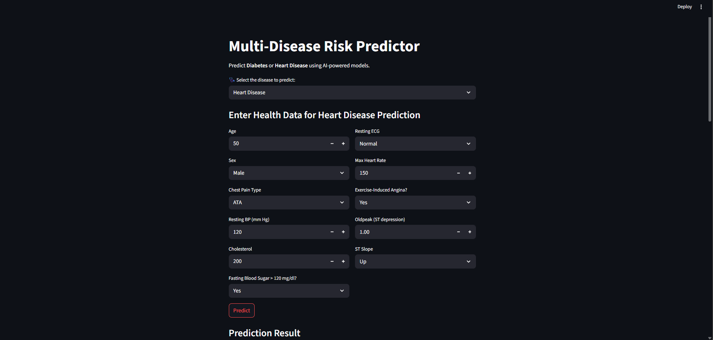
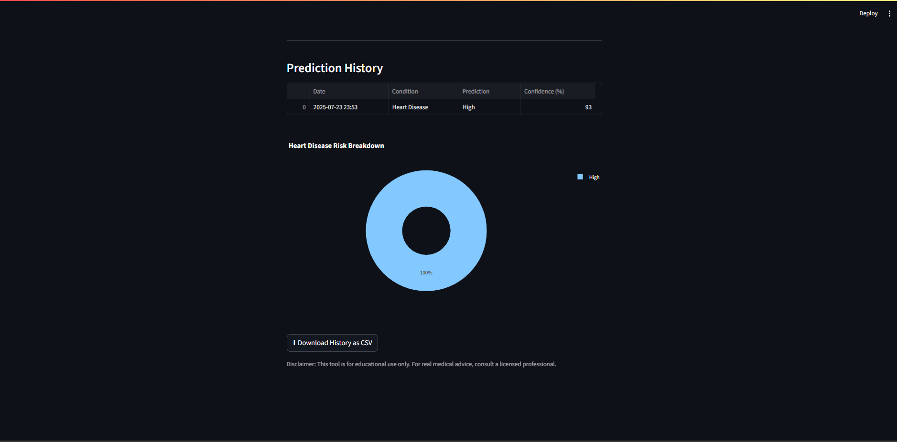

# Multi-Disease Risk Predictor

[ Live App](https://ai-disease-prediction-app.streamlit.app)
#updated vesion
[ Live App](https://healthguardv2.streamlit.app/)
---------------------------------------------------------------------------------------------------------------------
#updated v2

✨ What's New in v2.0
Feature	Description
🧠 Offline Mode	Diagnoses and tips using locally stored ML models when no internet is available
🎙️ Whisper Voice Input	Converts user speech to text using OpenAI's Whisper model for real-time queries
💬 Chat Memory	Tracks conversation history between user and Dr. Guard
📈 Risk Simulator	Estimates health risks based on age, vitals, and symptoms
📤 Contact Form	Integrated feedback sender with mailto-based support
📜 Sidebar Chat Viewer	Displays recent exchanges and offers clear history management
🧠 TF-IDF Integration	Symptom vectorization for quick offline diagnosis matching
🖤 Footer & Disclaimer	Professional footer with team credits and medical disclaimer
🛠 Tech Stack
Streamlit for UI and real-time deployment

Whisper for audio transcription

scikit-learn for TF-IDF and model training

RapidAPI for online health diagnostics

pickle for efficient offline storage

dotenv for secure API key management

streamlit-webrtc for voice capture and processing

An AI-powered web application that predicts the risk of **Diabetes** or **Heart Disease** using user-provided health metrics.  


nstallation & Run
bash
# Clone the repo
git clone https://github.com/yourusername/healthguard-ultra

# Activate your environment & install dependencies
pip install -r requirements.txt

# Run the app
streamlit run app.py
Make sure to add your RapidAPI key in a .env file:

RAPID_API_KEY=your_actual_key_here
🚀 Coming Soon (v2.1+)
Future Feature	Summary
🔁 Symptom History Export	Download diagnostic log as CSV
🌍 Multilingual Support	Support for Swahili, Arabic, French, and Spanish
📷 Visual Symptom Input	Upload skin rashes, X-rays, or photos for enhanced analysis
🧠 Advanced Model Switching	Auto-switch between Naive Bayes, XGBoost, and Transformer-based models
🧑🏾‍⚕️ Dr. Guard Persona Bot	A friendly assistant with personality, humor, and context-aware advice
🔒 Consent & Privacy Controls	Settings for data saving, voice recording, and export preferences
| 
---------------------------------------------------------“Ensemble, tout est réalisable!!”-----------------------------------------------------------------------

##  Features

- **Dual Prediction Models** — Supports risk prediction for both Diabetes and Heart Disease
- **Interactive Visualization** — Gauge chart shows model confidence visually
- **Validated Inputs** — Ensures user entries follow safe, expected medical ranges
- **Prediction History** — Automatically logs each prediction with time and condition
- **Data Export** — Download your prediction history as a CSV file

---

##  Screenshots

###  Input Form


###  Prediction Results


###  History View


---

##  How It Works

1. **Select Disease** — Choose either Diabetes or Heart Disease
2. **Enter Metrics** — Input your current health measurements
3. **Get Prediction** — Instantly receive a risk score with confidence level
4. **View Recommendations** — Get AI-generated health advice

---

##  Input Parameters

###  Diabetes Prediction

| Parameter            | Description                               | Range   |
|----------------------|-------------------------------------------|---------|
| Pregnancies          | Number of pregnancies                     | 0–20    |
| Glucose Level        | Blood glucose concentration (mg/dL)       | 0–200   |
| Blood Pressure       | Diastolic blood pressure (mm Hg)          | 0–180   |
| Skin Thickness       | Triceps skin fold thickness (mm)          | 0–100   |
| Insulin              | 2-Hour serum insulin (mu U/ml)            | 0–300   |
| BMI                  | Body Mass Index                           | 0–60    |
| Diabetes Pedigree    | Family history likelihood                 | 0–2.5   |
| Age                  | Age in years                              | 1–120   |

###  Heart Disease Prediction

| Parameter            | Description                               | Range / Options        |
|----------------------|-------------------------------------------|------------------------|
| Age                  | Age in years                              | 20–100                 |
| Sex                  | Biological sex                            | Male / Female          |
| Chest Pain Type      | Type of chest pain                        | ATA / NAP / ASY / TA   |
| Resting BP           | Resting blood pressure (mm Hg)            | 80–200                 |
| Cholesterol          | Serum cholesterol (mg/dL)                 | 100–400                |
| Fasting BS           | Fasting blood sugar >120 mg/dl?           | Yes / No               |
| Resting ECG          | ECG results                               | Normal / ST / LVH      |
| Max HR               | Maximum heart rate                        | 60–220                 |
| Exercise Angina      | Exercise-induced angina?                  | Yes / No               |
| Oldpeak              | ST depression from exercise               | 0.0–6.0                |
| ST Slope             | Slope of peak ST segment                  | Up / Flat / Down       |

---

##  Output Interpretation

- **Low Risk** — Green display with positive suggestions
- **High Risk** — Red warning with urgent health guidance
- **Confidence Level** — Gauge from 0%–100% representing model certainty

```python
# Core prediction logic (simplified)
prediction = model.predict(user_input)[0]
confidence = model.predict_proba(user_input)[0][prediction] * 100
```

---

##  Project Structure

```
├── venv/                # Virtual environment
├── data/                # Raw datasets
│   ├── heart.csv
│   └── pima_diabetes_data.csv
├── models/              # Trained machine learning models
├── notebooks/           # Model training and experiments (Jupyter)
│   ├── diabetes-prediction.ipynb
│   └── heart-disease-prediction.ipynb
├── screenshots/         # App interface screenshots
│   ├── inputs.png
│   ├── results.png
│   └── history.png
├── app.py               # Streamlit application
└── README.md            # This file
```

---

##  Disclaimer

This app is **not a substitute for medical diagnosis**. Please consult a licensed healthcare provider for any health concerns.

---

© 2025 HealthGuard AI — All rights reserved.
